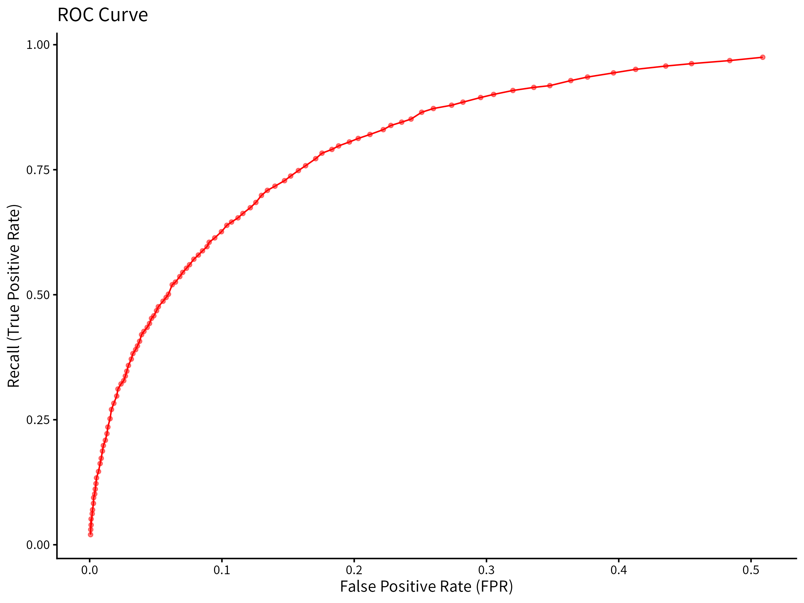
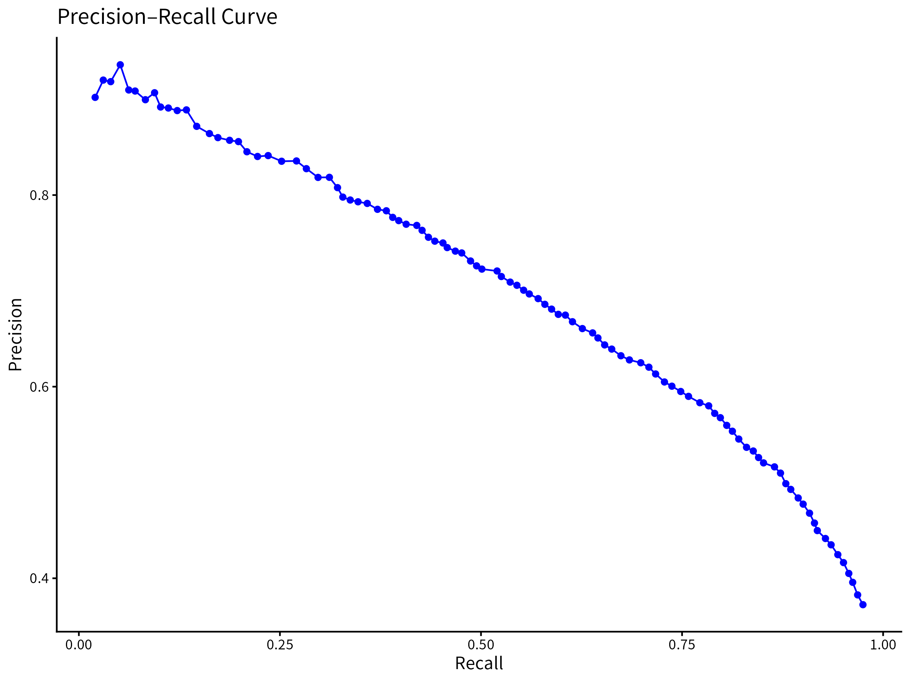

# m6APrediction

## Purpose

The **m6A Prediction** package provides tools to predict m6A RNA modification sites using machine learning models.\
It includes functions for sequence-based prediction and feature-based prediction, enabling researchers to analyze RNA-seq data efficiently.

The package provides utilities for:

\- DNA sequence encoding (`dna_encoding`)

\- Single-sample prediction (`prediction_single`)

\- Multi-sample prediction (`prediction_multiple`)

------------------------------------------------------------------------

## Installation

You can install the package directly from GitHub using either **devtools** or **remotes**:

``` r
# Using devtools
install.packages("devtools")
devtools::install_github("txy729/m6APrediction")
```

``` r
# Or using remotes
install.packages("remotes")
remotes::install_github("txy729/m6APrediction")
```

## Example Usage

Here is a minimal example demonstrating the two prediction functions:
``` r
library(m6APrediction)

# Example RNA sequence
seq <- "AUGCUACGUAUCG"

# Prediction using sequence-based function
result_seq <- predict_m6A_sequence(seq)
print(result_seq)

# Prediction using feature-based function
features <- data.frame(GC_content = 0.45, length = 120)
result_feat <- predict_m6A_features(features)
print(result_feat)
```

## Model Performance

To showcase the strong performance of our model, we include ROC and PRC curves




